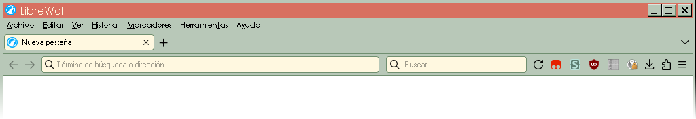

Works best with Compact density on.

To install, get
[userchromeJS](https://github.com/xiaoxiaoflood/firefox-scripts) first, then
unzip this repo to your profile's chrome folder.

I recently switched to LibreWolf from Firefox and had to abandon my previous
theme for what I have now.

This repo is that theme. It's a version of the default Firefox Quantum theme
without all the godawful padding everywhere. Also it has native coloring (i.e.
Windows Classic Theme) using CSS system colors.

